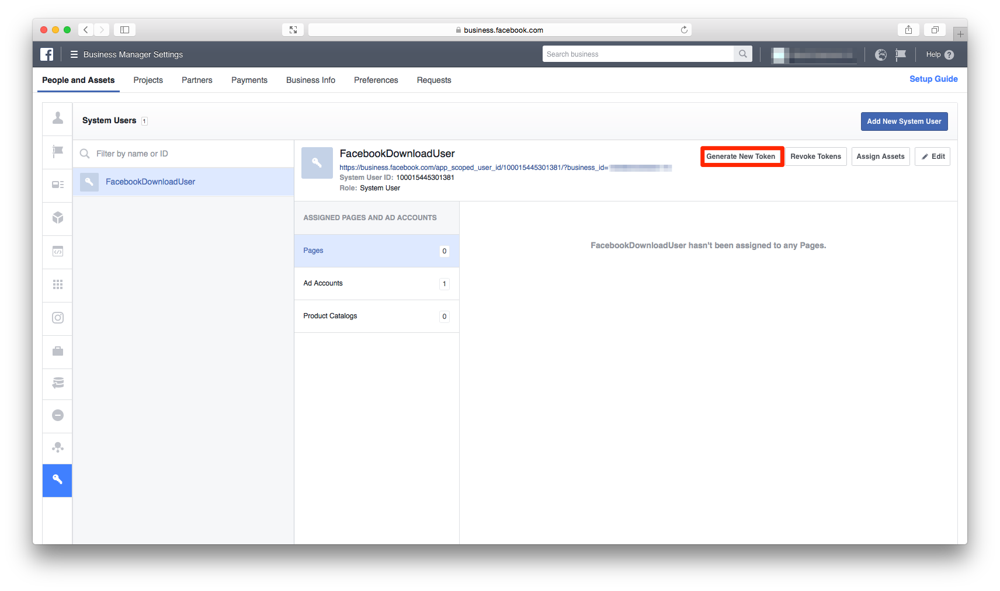

# Facebook Ads Performance Downloader

A Python script for downloading structure and performance data from ad accounts in a single [business manager](https://developers.facebook.com/docs/apps/business-manager) using the Facebook Ads API ([v2.9](https://developers.facebook.com/docs/marketing-api/reference/v2.9)) to local files. 

## Resulting data
By default, it creates two data sets:

1. **Ad Performance** consists of measures such as impressions, clicks, conversions and spend. The script creates one sqlite3 database per day and ad account in a specified time range:

        data/2017/01/01/facebook/ad-performance-act_1234567890.sqlite3
        data/2017/01/02/facebook/ad-performance-act_1234567890.sqlite3

    For the last 28 days, the script always redownloads the files as data still changes (e.g spend or attributed conversions). Beyond that, files are only downloaded for dates where the ad account existed but the file is missing. 
    **Note**: If you are using an attribution window larger than 28 days adjust the `redownload_window` config accordingly.
    
    The resulting sqlite3 databases contain a single table `ad_performance`, with individual rows per ad and the device and placement breakdown. See [Insights Breakdowns](https://developers.facebook.com/docs/marketing-api/insights/breakdowns/v2.9) for a documentation of the breakdown. The performance data is stored in JSON format in a single column

        date        | 2017-01-01
        ad_id       | 1234567890
        device      | desktop
        placement   | desktop_feed
        performance | {"spend": 0.42,  
                    |  "impressions": 25,
                    |  "actions": [{"value": 1.0, "28d_click": 1.0, "action_type": "link_click"}, 
                    |              {"value": 20.0, "28d_click": 20.0, "action_type": "offsite_conversion.fb_pixel_add_to_cart"}, 
                    |              {"value": 2.0, "28d_click": 2.0, "action_type": "offsite_conversion.fb_pixel_purchase"}, 
                    |              {"value": 18.0, "28d_click": 17.0, "action_type": "offsite_conversion.fb_pixel_view_content"}, 
                    |              {"value": 1.0, "28d_click": 1.0, "action_type": "page_engagement"}, 
                    |              {"value": 1.0, "28d_click": 1.0, "action_type": "post_engagement"}, 
                    |              {"value": 45.0, "28d_click": 34.0, "action_type": "offsite_conversion"}], 
                    |  "action_values": [{"value": 2.0, "28d_click": 2.0, "action_type": "offsite_conversion.fb_pixel_purchase"}, 
                    |                    {"value": 2.0, "28d_click": 2.0, "action_type": "offsite_conversion"}]}
                    
    See [Insights Fields](https://developers.facebook.com/docs/marketing-api/insights/fields) for a documentation of the fields.
    
2. **Account Structure** information. This file is always overwritten by the script:

        data/facebook-account-structure_v1.csv.gz

    Each line contains one ad together with its ad group, campaign and account:
    
        ad_id         | 1234567890
        ad_name       | Foo
        ad_group_id   | 3456789012
        ad_group_name | Bar
        campaign_id   | 5678901234
        campaign_name | Baz
        account_id    | 7890123456
        account_name  | Qux
        attributes    | {"Target": "buyer", "Channel": "reactivation", "Country": "France", "Language": "French"}

    The `attributes` field contains a JSON representation of all [labels](https://support.google.com/adwords/answer/2475865) of an ad or its parents in a `{Key=Value}` syntax. For example an account has the label `{Channel=reactivation}`, then all ads below will have the `"Channel": "reactivation"`. 
    **Note**: Labels on lower levels overwrite those from higher levels.

## Getting Started

### Prerequisites

To use the Facebook Ads Performance Downloader you have to

- consolidate all accounts of a company under a single [business manager](https://developers.facebook.com/docs/apps/business-manager), 
- create a normal [system user](https://developers.facebook.com/docs/marketing-api/businessmanager/systemuser) for that business manager using the guide in the link or the [System User page](https://business.facebook.com/settings/system-users) in your business manager.
- give the system user access to all ad accounts that should be downloaded,
- create an [app](https://developers.facebook.com/docs/apps/register#step-by-step-guide) and disable development mode,
- set up app and system user credentials to access the Facebook Ads API. See [Set up your credentials](#set-up-your-credentials) for the necessary steps.

Optionally, you can apply labels on all hierarchy levels for segmenting the structure.

### Installation

 The Facebook Ads Performance Downloader requires:

    Python (>= 3.5)
    facebookads (==2.9.2)
    click (>=6.0)

The easiest way to install facebook-ads-downloader is using pip

    pip install git+https://github.com/mara/facebook-ads-performance-downloader.git

In case you want to install it in a virtual environment:

    $ git clone git@github.com:mara/facebook-ads-performance-downloader.git facebook_downloader
    $ cd facebook_downloader
    $ python3 -m venv .venv
    $ .venv/bin/pip install .

### Set up your credentials

Find the `app_id` and `app_secret` in your app's dashboard at `https://developers.facebook.com/apps/<YOUR_APP_ID>/dashboard/`:

Log into your Facebook account and go to the system users page of your company's business manager at `https://business.facebook.com/settings/system-users` and click on *Generate New Token*:

Select the app you want to use to download the data, activate the `read_insights` and `ads_read` scope and generate the token:

The generated `access_token` is then shown to you:

## Usage

To run the Facebook Ads Performance Downloader call `download-facebook-performance-data` with its config parameters:  

    $ download-facebook-performance-data --app_id 1234567890 \
    --app_secret ABCDEFEGHIJKL \
    --access_token aBcDeFgHiJkLmNoPqRsTuVwXyZ \
    --data_dir /tmp/facebook
