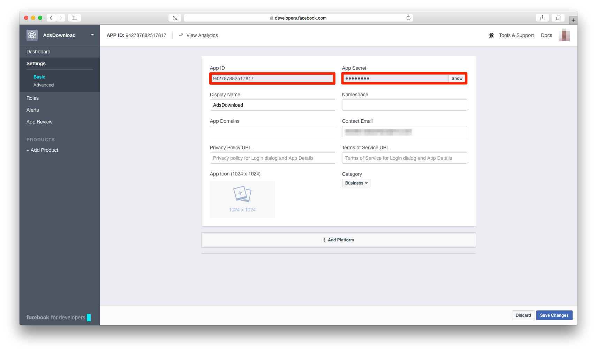
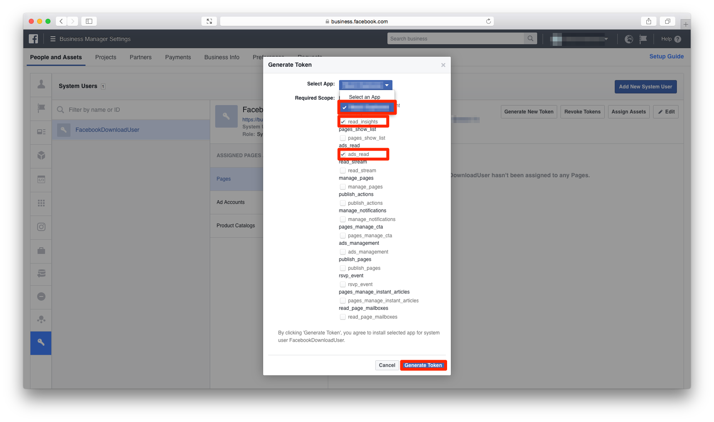
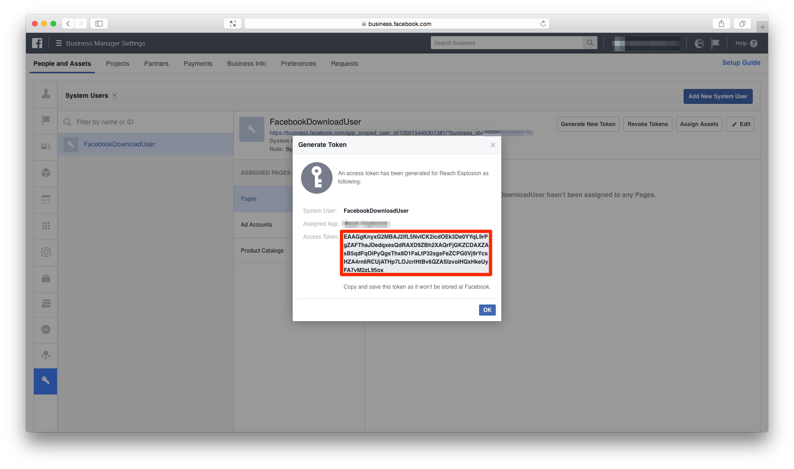
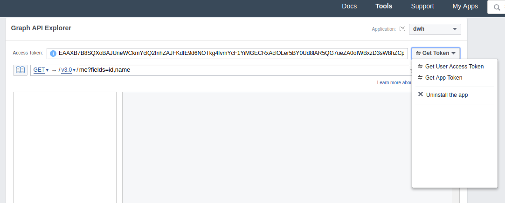

# Facebook Ads Performance Downloader

A Python script for downloading structure and performance data from ad accounts in a single [business manager](https://developers.facebook.com/docs/apps/business-manager) using the Facebook Ads API ([v3.1](https://developers.facebook.com/docs/marketing-api/reference/v3.1)) to local files. 

## Resulting data
By default, it creates two data sets:

1. **Ad Performance** consists of measures such as impressions, clicks, conversions and spend. The script creates one sqlite3 database per day and ad account in a specified time range:

        data/2017/01/01/facebook/ad-performance-act-1234567890-v2.sqlite3
        data/2017/01/02/facebook/ad-performance-act-1234567890-v2.sqlite3

    For the last 28 days, the script always redownloads the files as data still changes (e.g spend or attributed conversions). Beyond that, files are only downloaded for dates where the ad account existed but the file is missing. 
    **Note**: If you are using an attribution window larger than 28 days adjust the `redownload_window` config accordingly.
    
    The resulting sqlite3 databases contain a single table `ad_performance`, with individual rows per ad and the device and placement breakdown. See [Insights Breakdowns](https://developers.facebook.com/docs/marketing-api/insights/breakdowns/v3.1) for a documentation of the breakdown. The performance data is stored in JSON format in a single column

        date        | 2017-01-01
        ad_id       | 1234567890
        device      | desktop
        placement   | desktop_feed
        performance | {"spend": 0.42,  
                    |  "impressions": 25,
                    |  "actions": [{"value": 1.0, "28d_click": 1.0, "action_type": "link_click"}, 
                    |              {"value": 20.0, "28d_click": 20.0, "action_type": "offsite_conversion.fb_pixel_add_to_cart"}, 
                    |              {"value": 2.0, "28d_click": 2.0, "action_type": "offsite_conversion.fb_pixel_purchase"}, 
                    |              {"value": 18.0, "28d_click": 17.0, "action_type": "offsite_conversion.fb_pixel_view_content"}, 
                    |              {"value": 1.0, "28d_click": 1.0, "action_type": "page_engagement"}, 
                    |              {"value": 1.0, "28d_click": 1.0, "action_type": "post_engagement"}, 
                    |              {"value": 45.0, "28d_click": 34.0, "action_type": "offsite_conversion"}], 
                    |  "action_values": [{"value": 2.0, "28d_click": 2.0, "action_type": "offsite_conversion.fb_pixel_purchase"}, 
                    |                    {"value": 2.0, "28d_click": 2.0, "action_type": "offsite_conversion"}]}
                    
    See [Insights Fields](https://developers.facebook.com/docs/marketing-api/insights/fields) for a documentation of the fields.
    
2. **Account Structure** information. This sqlite3 database containes one table `account_structure` which is always upserted by the script:

        data/facebook-account-structure-v2.sqlite3

    Each rows contains one ad together with its ad group, campaign and account:
    
        ad_id         | 1234567890
        ad_name       | Foo
        ad_group_id   | 3456789012
        ad_group_name | Bar
        campaign_id   | 5678901234
        campaign_name | Baz
        account_id    | 7890123456
        account_name  | Qux
        attributes    | {"Target": "buyer", "Channel": "reactivation", "Country": "France", "Language": "French"}

    The `attributes` field contains a JSON representation of all [labels](https://support.google.com/adwords/answer/2475865) of an ad or its parents in a `{Key=Value}` syntax. For example an account has the label `{Channel=reactivation}`, then all ads below will have the `"Channel": "reactivation"`. 
    **Note**: Labels on lower levels overwrite those from higher levels.

## Getting Started

### Prerequisites

To use the Facebook Ads Performance Downloader you have to

- consolidate all accounts of a company under a single [business manager](https://developers.facebook.com/docs/apps/business-manager), 
- create a normal [system user](https://developers.facebook.com/docs/marketing-api/businessmanager/systemuser) for that business manager using the guide in the link or the [System User page](https://business.facebook.com/settings/system-users) in your business manager.
- give the system user access to all ad accounts that should be downloaded,
- create an [app](https://developers.facebook.com/docs/apps/register#step-by-step-guide) and disable development mode,
- set up app and system user credentials to access the Facebook Ads API. See [Set up your credentials](#set-up-your-credentials) for the necessary steps.

Optionally, you can apply labels on all hierarchy levels for segmenting the structure.

### Installation

 The Facebook Ads Performance Downloader requires:

    Python (>= 3.5)
    facebook_business (==3.0.0)
    click (>=6.0)

The easiest way to install facebook-ads-downloader is using pip

    pip install git+https://github.com/mara/facebook-ads-performance-downloader.git

In case you want to install it in a virtual environment:

    $ git clone git@github.com:mara/facebook-ads-performance-downloader.git facebook_downloader
    $ cd facebook_downloader
    $ python3 -m venv .venv
    $ .venv/bin/pip install .

### Set up your credentials

Find the `app_id` and `app_secret` in your app's dashboard at `https://developers.facebook.com/apps/<YOUR_APP_ID>/dashboard/`:

Log into your Facebook account and go to the system users page of your company's business manager at `https://business.facebook.com/settings/system-users` and click on *Generate New Token*:

Select the app you want to use to download the data, activate the `read_insights` and `ads_read` scope and generate the token:

The generated `access_token` is then shown to you:

Currently Facebook requires you to perform a number of successful API calls before being able to access more than 5 accounts. If that's the case use the `target_accounts` parameter to specify these 5 accounts and avoid API errors.

### Refresh API Token
Facebook invalidates the API token once every couple of months. To refresh it, go to `https://developers.facebook.com/tools/explorer/<YOUR_APP_ID>`:

Click on `Get User Access Token`, select `read_insights` and `ads_read`, and generate the new token, which will appear in the line next to the button pressed on the screenshot. This will generate a short-lived access token. To extend it, go to `https://developers.facebook.com/tools/debug/accesstoken/?access_token=<GENERATED_SHORT_LIVED_TOKEN>` (or click on the (i)nformation icon next to the token and choose _Open in Access Token Tool_) and click on _Extend Access Token_ button. The new long-lived access token will be displayed below.

## Usage

To run the Facebook Ads Performance Downloader call `download-facebook-performance-data` with its config parameters:  

    $ download-facebook-performance-data --app_id 1234567890 \
    --app_secret ABCDEFEGHIJKL \
    --access_token aBcDeFgHiJkLmNoPqRsTuVwXyZ \
    --data_dir /tmp/facebook

For all options, see 

    $ download-facebook-performance-data --help
    Usage: download-facebook-performance-data [OPTIONS]
    
      Downloads data. When options are not specified, then the defaults from
      config.py are used.
    
    Options:
      --app_id TEXT             The app id obtained from the app's settings in
                                facebook for developers
                                
                                https://developers.facebo
                                ok.com/apps/<APP_ID>/settings/. Example:
                                "1234567890"
      --app_secret TEXT         The app secret obtained from the app's settings in
                                facebook for developers
                                
                                https://developers.facebo
                                ok.com/apps/<APP_ID>/settings/. Example: "aBcDeFg"
      --access_token TEXT       The access token of the system user with the
                                following credentials:
                                - read_insights
                                - ads_read
                                https://business.facebook.com/settings/system-
                                users/<SYSTEM_USER_ID>?business_id=<BUSINESS_ID>.
                                Example: "foo"
      --data_dir TEXT           The directory where result data is written to.
                                Example: "/tmp/facebook_ads"
      --first_date TEXT         The first day for which data is downloaded.
                                Example: "2015-01-01"
      --redownload_window TEXT  The number of days for which the performance data
                                will be redownloaded. Example: "28"
      --target_accounts TEXT    The accounts to download, comma separated, if not
                                set or empty each available account will be tried.
                                Example: ""
      --number_of_ad_performance_threads TEXT
                                The number of threads used to download ad
                                performance. Example: "10"
      --help                    Show this message and exit.
